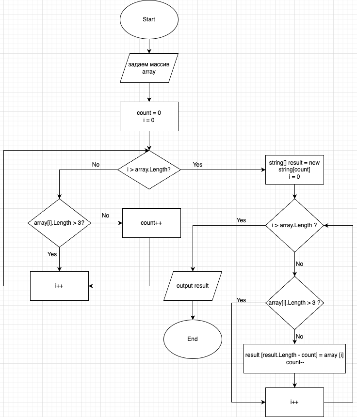

# Итоговая работа по блоку 1

_**Формулировка задачи**_

Написать программу, которая из имеющегося массива строк формирует массив из строк, длина которых меньше либо равна трём символам. Первоначальный массив можно ввести с клавиатуры, либо задать на старте выполнения алгоритма. При решении не рекомендуется пользоваться коллекциями, лучше обойтись исключительно массивами.

_**Алгоритм решения программы:**_

1. Инициализируем вспомогательную переменную count = 0, в которую запишем количество строк, длина которых меньши или равна 3. 

2. Вычисляем количество строк, длинна которых меньше либо равна 3 символам.

_В цикле проходим по каждой строке массива. На каждой итерации сверяем длину строки - если длина меньше или равна 3 инкрементируем ранее инициализируемую переменную count и инкрементируем счётчик цикла. Если длина больше трёх инкрементируем только счётчик цикла._

3. Инициализируем массив результатов размером count.

4. Формируем массив с результатами.

_Снова в цикле проходим по каждой строке и также сравниваем на каждой итерации длину строки. Однако, теперь если длина меньше или равна трём, мы в текущий массив добавляем данную строку, декрементируем count и инкрементируем счётчик цикла, иначе только инкрементируем счётчик цикла. Декрементировать счётчик количества строк count необходимо для правильного заполнения массива: мы из размера массива вычитаем текущее значение данного счётчика._

5. Выводим массив результатов в консоль
В данном алгоритме пункты 2, 4 и 5 можно выполнить в виде отдельных функций.

### Блок-схема алгоритма:

## Примеры массивов и результаты выводов

["hello", "2", "world", ":-)"] -> ["2", ":-)"]

["1234", "1567", "-2", "computer science"] -> ["-2"]

["Russia", "Denmark", "Kazan"] -> []